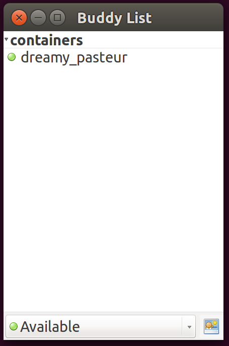
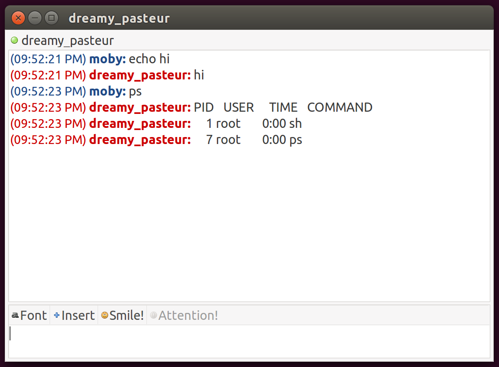

# purple-docker: A libpurple protocol plugin for your Docker containers

Haven't you always wanted to chat with your containers?  Now, with
purple-docker, you can!

## What?

purple-docker implements a protocol plugin (prpl) that tracks running Docker
containers in your buddy list and presents STDIO via the chat interface.

## This is a terrible idea

Yes.

## Why would you even do that?

This is a toy project because I wanted to learn more about CGo and building
shared libraries.

## What does it do?

Maybe some screenshots would help?





## How do I install it?

Make sure you've got the `libpurple-dev` package installed (or at least have
the headers in a place that `pkg-config` can find), then:

```bash
go get github.com/samuelkarp/purple-docker
cd $GOPATH/src/github.com/samuelkarp/purple-docker
make localinstall
```

You can then launch a libpurple chat client (like pidgin) and set up an account
with the purple-docker protocol.

## How do I use it?

Run a libpurple chat program (like Pidgin) and create a new account with the
"Docker (purple-docker)" protocol.  Enable the account, and then start creating
containers.  (Note: purple-docker currently only supports interactive
containers and attaches to STDIO.)

The images above were created with a container launched by running `docker run
-d -i busybox`.

## Bugs?!

We got 'em!  Feel free to open an issue, but also feel free to fix the bugs and
send a pull request.  This is not a serious project, so bugs may not get fixed
otherwise.

## Contributions?

Yes, please!